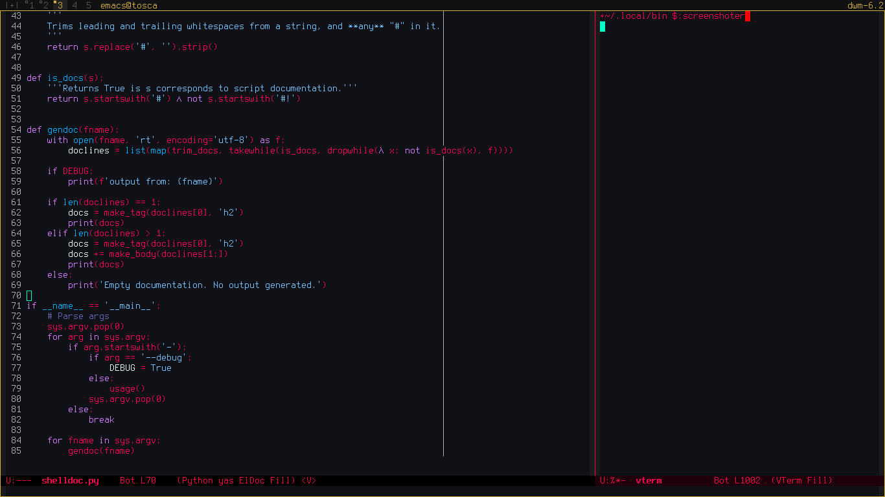

# Punchy Cyberpunk Theme


Inspiration: https://github.com/prometheux-ar/cyberpunk

## emacs

Copy `emacs/cyberpunk-theme.el` to a directory listed in `custom-theme-load-path`
(by default it is `~/.emacs.d`) and put this in your `init.el`

```elisp
(load-theme 'cyberpunk t)
```

## Vim

Copy the file in the colors directory to `.vimrc/colors` or `~/.config/nvim/colors`.

```vimscript
set termguicolors
colorscheme cyberpunk
```

## Screenshots

### emacs




