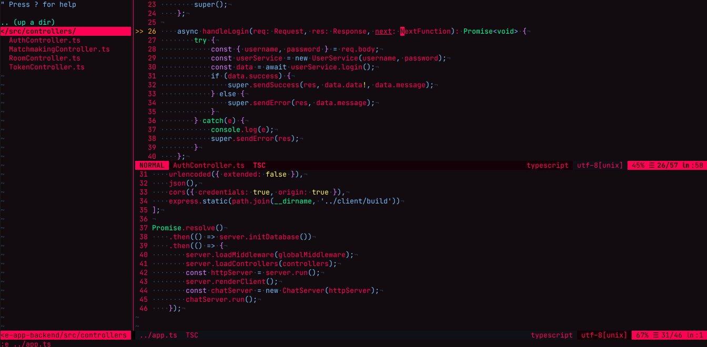
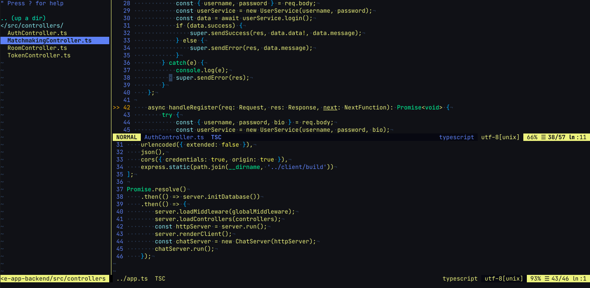

# Vim Cyberpunk Theme: 2 variations

## Installation

Copy a file from `colorscheme` folder to `.vim/colors/` or `~/.config/nvim/colors`, then copy a corresponding file to your `vim-airline-themes` folder (e.g. `.config/nvim/plugged/vim-airline-themes/autoload/airline/themes/`), and add these lines to your `.vimrc` (or `init.vim`):

For Cyberpunk theme:

```vimscript
set termguicolors
colorscheme cyberpunk
let g:airline_theme='cyberpunk'
```

For Silverhand theme, change `cyberpunk` in the above lines to `silverhand`.

## Screenshots



