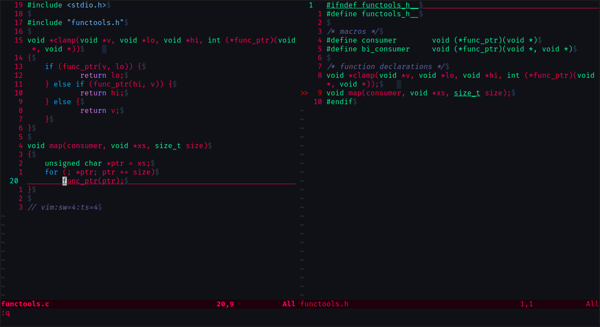

# Punchy Cyberpunk theme for Vim



Inspiration: https://github.com/prometheux-ar/cyberpunk

## Installation

Copy the file in the colors directory to `.vimrc/colors` or `~/.config/nvim/colors`.

```vimscript
set termguicolors
colorscheme cyberpunk
```
